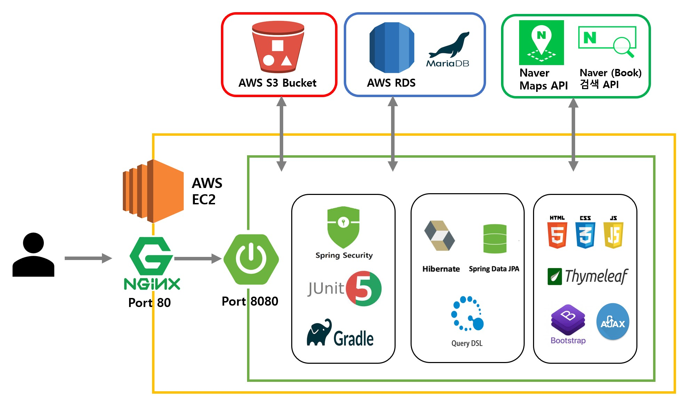
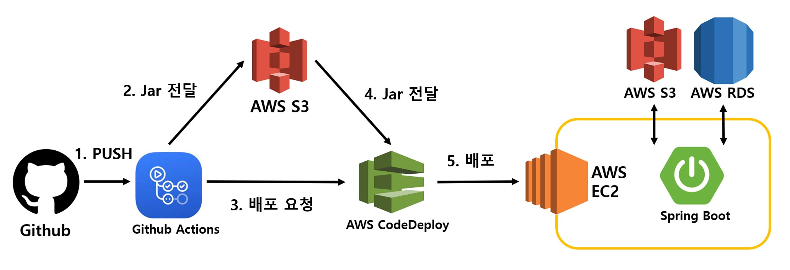
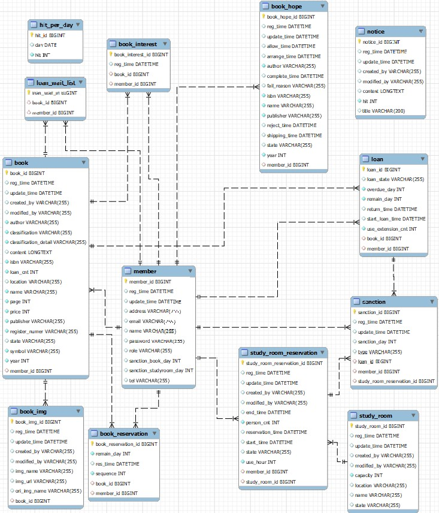

# Library-Management-System

배포주소 : [http://54.180.182.109](http://54.180.182.109/)

작품 주제 : 스프링부트를 이용한 도서관 관리 시스템

개발기간 : 2022.06.20 ~ 2022.09.25

# **작품 구성도**

1. 시스템 구성도

2. CI/CD 구성도

# 데이터베이스

- member : 사용자 정보 저장
- book : 책 정보
- book_imt : 책 이미지 정보
- book_interest : 관심도서 등록 정보
- book_reservation : 도서예약 정보
- book_hope : 희망도서 신청 정보
- loan : 도서 대출정보
- loan_wait_list : 대출 대기 도서 저장
- studyroom : 스터디룸 정보
- study_room_reservation : 스터디룸 예약 정보
- sanction : 도서 대출, 스터디룸 예약 제재 저장
- notice : 공지사항 정보
- hit_per_day : 일별 방문횟수 저장

# 기능

## 도서관 이용고객 

### - 계정기능
회원가입과 로그인을 할 수 있습니다. 마이페이지에서 회원정보를 수정할 수 있습니다.
### - 자료검색
도서관에서 소장중인 도서를 책이름, ISBN, 저자, 출판사, 출판년도를 입력해 검색할 수 있습니다.
### - 도서 예약
대출 중인 도서에 대해 예약신청을 할 수 있습니다.
### - 관심도서 추가
관심도서를 추가해 마이페이지에서 확인할 수 있습니다.
### - 네이버 검색 API 도서 검색 
네이버 검색 API를 통해서 도서 이름으로 도서를 검색하고 정보를 얻을 수 있습니다.
### - 희망도서 신청
회원가입과 로그인을 할 수 있습니다.
### - 스터디룸 예약
스터디룸을 예약할 수 있습니다.
### - 마이페이지
대출 중 도서(반납연장 기능), 연체 도서, 예약 도서, 관심도서(나의서재), 희망도서 신청, 대출 이력, 스터디룸 예약 현황, 제재 내역을 확인할 수 있습니다.

### - 공지사항 확인 
공지사항을 확인할 수 있습니다.

## 도서관 직원

### - 계정기능
회원가입과 로그인을 할 수 있습니다.
### - 새로운 책 입고
도서를 등록할 수 있습니다.
### - 희망도서 신청 관리
사용자가 신청한 희망도서 신청을 처리할 수 있습니다.
### - 대출, 반납
일반유저에게 도서 대출, 반납, 분실 처리를 할 수 있습니다.
### - 스터디룸 예약 관리
스터디룸 등록, 수정, 삭제. 스터디룸 예약 처리를 할 수 있습니다.
### - 공지사항 등록
공지사항을 등록, 수정, 삭제할 수 있습니다.

 
 

# 동작화면

## **메인화면**

 

## **기능 - 계정기능**

회원가입 시 일반사용자, 도서관 직원 중 하나를 선택해 회원가입을 할 수 있습니다.

주소는 필수 입력, 전화번호는 선택 입력값입니다.

 

## 자료검색(일반 사용자)

소장중인 도서를 책이름, ISBN, 저자, 출판사, 출판년도를 입력해 검색할 수 있습니다.

 

## 도서 예약, 관심도서 추가(일반 사용자)

자료검색 후 해당 도서의 이름을 클릭하면 상세보기 페이지로 이동합니다. 상세보기 페이지에서는 해당 도서의 정보를 확인할 수 있습니다.

해당 도서가 대출 중이면 도서 예약이 가능합니다.

관심도서담기 버튼을 클릭하면 마이페이지에서 확인이 가능합니다.

 

## 네이버 검색 API 도서 검색 (일반 사용자)

네이버 검색 API를 통해 도서를 검색할 수 있습니다.

 

## 희망도서 신청(일반 사용자)

희망도서를 신청할 수 있습니다.

사용자가 직접 정보를 입력해 신청할 수 있고, 네이버 검색 API를 통해 '희망도서 신청하기' 버튼을 클릭하면 책이름, ISBN, 저자, 출판사, 출판년도가 자동으로 입력되 사용자가 직접 입력하지 않고 희망도서 신청이 가능합니다.

 

## 스터디룸 예약(일반 사용자)

스터디룸을 예약할 수 있습니다. 예약 내역은 마이페이지에서 확인 가능합니다.

 

## 마이페이지(일반 사용자)

일반 사용자 마이페이지에서는 사용자 정보를 수정할 수 있습니다.

[대출중인 도서] : 대출 중인 도서 조회. 반납 기한 연장 기능.

[연체중인 도서] : 연체 중인 도서 조회.

[예약중인 도서] : 예약한 도서 조회. 예약 취소 기능.

[나의서재] : 관심도서 조회. 관심도서 삭제.

[희망도서 신청] : 신청한 희망도서 신청 내역 조회. 진행상황 상세 조회.

[대출 이력] : 대출 이력 조회.

[스터리룸 예약 현황] : 스터디룸 예약 조회. 예약 취소.

[제재 내역] : 도서 연체, 스터디룸 예약 후 노쇼로 인한 제재 내역 조회.

 

## 각종 정보 확인(일반 사용자)

공지사항, 도서관 위치, 정책 등을 확인할 수 있습니다.

 

## 새로운 책 등록(도서관 직원)

새로운 책을 등록하기 위해서는 이미지를 함께 등록해야 합니다. 같은 ISBN을 가진 도서를 등록할 수 있습니다. 하지만 등록번호, 청구기호는 유일해야 합니다.

 

## 대출, 반납(도서관 직원)

대출, 반납을 원하는 일반 사용자를 검색해 해당 이메일을 클릭합니다.

대출하고 싶은 도서를 대출대기 버튼을 클릭해 대출 대기 구역으로 이동시키고, 대출하기 버튼을 클릭하면 대출처리 됩니다.

반납 버튼을 클릭하면 반납처리, 분실 버튼을 클릭하면 해당 도서는 분실 처리가 됩니다.

 

## 희망도서 신청 관리(도서관 직원)

일반 사용자가 신청한 희망도서 신청을 처리합니다. 일반 사용자는 마이페이지를 통해 희망도서 신청 진행상황을 확인할 수 있습니다. 

 

## 스터디룸 예약 관리(도서관 직원)

[스터디룸 관리] : 스터디룸 등록, 수정, 사용 중단, 사용 재개

[승인 대기중 예약] : 일반 유저가 예약에 대해서 승인, 거절 기능

[입실 대기] : 승인 완료된 예약 조회, 입실처리, 예약취소처리, no-show 처리 기능

[사용 중 스터디룸] : 입실처리 된 예약 조회 및 퇴실 처리 기능

[처리완료 예약] 예약거절, no-show, 퇴실 처리된 예약 조회

 

## 공지사항 관리(도서관 직원)

공지사항을 등록, 수정, 삭제할 수 있습니다. 

