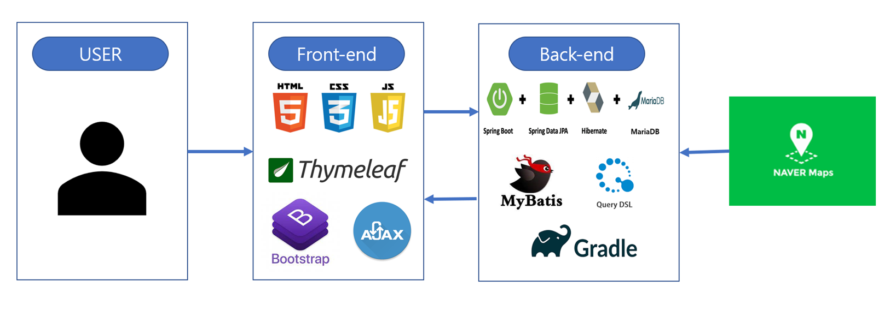

# Library-Management-System

Role: Back-end Dev, Front-end Dev, JPA, MySQL, SpringBoot
소요시간: 2022.06.20 ~ 개발중
유형: 개인프로젝트

[GitHub - ehs2803/Library-Management-System: 도서관 시스템(웹) - spring boot 개인 프로젝트](https://github.com/ehs2803/Library-Management-System)

# 배포주소

[http://54.180.182.109:8080](http://54.180.182.109:8080/)

## **작품 주제**

스프링부트를 이용한 도서관리 시스템

## **개발기간**

2022.06.20 ~ 개발 중

## **작품 구성도**

1. 시스템 구성도

1. CI/CD 구성도

# 데이터베이스

# 기능

### **기능 - 계정기능**

---

회원가입 시 이메일 주소는 유일해야 합니다.

사용자 구분에서 일반사용자, 도서관직원 중 선택해야 합니다.

### **기능 - 마이페이지(일반유저)**

---

일반 유저 마이페이지 입니다. 기본적인 정보가 출력되고, 회원정보 수정 버튼을 클릭하면 회원정보를 수정할 수 있습니다.

대출중인 도서, 연체중인 도서, 예약중인 도서, 나의서제(관심도서), 희망도서신청, 대출이력, 스터디룸 예약현황을 볼 수 있습니다.

### **기능 - 마이페이지(도서관 직원)**

---

도서관 직원으로 로그인하면 관리자페이지에 접근할 수 있습니다. 관리자페이지에서는 새로운 책 입고, 희망도서 신청 관리, 도서 대출,반납, 스터디룸 관리할 수 있습니다.

### **기능 - 책 등록(도서관직원)**

---

도서관 직원은 새로운 책을 등록할 수 있습니다. 책을 등록할 때 도서 이미지를 첨부할 수 있습니다.

### **기능 - 대출, 반납 처리(도서관직원)**

---

도서관직원으로 로그인하면 일반 유저에 대해 도서 대출, 반납 처리를 할 수 있습니다. 

대출, 반납 페이지에서는 현재 가입한 일반 유저 목록을 볼 수 있고 검색 기능을 통해서 유저를 찾을 수 있습니다. 유저 이메일을 클릭하면 아래 사진 페이지로 이동합니다.

멤버 상세 정보구간은 클릭한 멤버 정보를 표시합니다. 

대출 현황은 해당 유저의 대출현황을 보여주고, 반납 버튼을 누르면 반납처리가 됩니다.

대출 대기 목록에 올라온 책을 대출하기 버튼을 누르면 대출처리가 됩니다.

도서검색 구간에서는 도서관에 등록된 책을 검색을 통해 조회할 수 있습니다.

위 사진처럼 도서를 검색 후 대출대기 버튼을 누르면 대출대기 구역으로 책이 이동하고, 대출대기를 누르면 해당 도서가 대출처리 됩니다.

### **기능 - 통합자료검색**

---

통합검색에서는 도서 이름 키워드로 도서를 검색할 수 있습니다.

*상세검색(출판년도, 출판사, 저자 검색)은 구현중입니다.

### **기능 - 도서예약, 관심도서 담기(일반유저)**

---

통합검색 결과로 나온 도서 책이름을 클릭하면 다음과 같이 도서 상세 페이지로 이동합니다.

같은 책이 여러권 있을 수도 있기때문에 표형태로 현재 등록된 책을 출력합니다.
그 밑에는 도서 관련 정보가 출력됩니다.

도서예약하기 버튼을 누르면 도서 예약이 가능합니다. 상태가 AVAILABLE(현재 도서관에서 바로 대출가능상태)인 경우 예약이 불가능해 도서예약버튼이 비활성화 됩니다. 최대 3명의 유저까지 예약이 가능합니다.

관심도서 담기 버튼을 누르면 마이페이지 내 나의서제에서 확인이 가능합니다. 관심도서 담기의 경우 제한이 없습니다.

### **기능 - 희망도서 신청(일반유저)**

---

일반 유저는 희망도서를 신청할 수 있습니다.

마이페이지에서는 희망도서 신청내역을 확인할 수 있습니다.

희망도서 신청 진행상황에 대한 현재 상태, 각 상태별 시간을 확인할 수 있습니다.

만약 도서관직원이 희망도서 신청을 거절했다면 거절사유를 확인할 수 있습니다.

### **기능 - 희망도서 신청 관리(도서관직원)**

---

① 도서관 직원은 관리자페이지에서 희망도서 신청을 처리할 수 있습니다.

② 검토, 승인, 배송, 정리, 완료, 거부 상태를 설정할 수 있습니다. 거절 시 거절사유를 적어야 합니다.

③ 마지막 완료 상태를 설정하기 전에 책추가하기 버튼을 클릭해 책을 추가할 수 있습니다.

④ 이때 일반 사용자가 희망도서를 신청할 때 입력한 책이름, ISBN, 저자, 출판사, 출판년도가 자동으로 입력됩니다.

### **기능 - 스터디룸 예약(일반유저)**

---

스터디룸 예약페이지에서 사용자는 상태가 CLOSE가 아닌 원하는 스터디룸을 선택해 예약할 수 있습니다. 예약현황 버튼을 클릭하면 현재 예약현황을 볼 수 있고, 예약하기 버튼을 클릭하면 아래 사진 페이지로 이동합니다.

스터디룸의 기본적인 정보, 해당 스터디룸 예약현황을 볼 수 있고, 예약날짜는 당일 예약은 불가능하고 +7일까지 예약날짜 선택이 가능합니다. 이용시간과 예약인원은 도서관 정책, 해당 스터디룸 수용인원에 따라 입력이 제한됩니다. 예약하기 버튼을 누르면 예약이 완료되고, 도서관 직원이 해당 예약을 승인해야 합니다.

### **기능 - 스터디룸 예약 관리(도서관 직원)**

---

도서관 직원은 스터디룸 예약 관리페이지에서 스터디룸 관리, 승인 대기중예약, 입실대기, 사용중스터디룸, 처리완료예약 페이지에 접근할 수 있습니다.

[스터디룸 관리]
스터디룸 등록, 수정

[승인 대기중 예약]
일반 유저가 예약에 대해서 승인, 거절 기능

[입실 대기]
승인 완료된 예약 조회,  입실처리, 예약취소처리, no-show 처리 기능

[사용 중 스터디룸]
입실처리 된 예약 조회 및 퇴실 처리 기능

[처리완료 예약]
예약거절, no-show, 퇴실 처리된 예약 조회

### **기능 - 스터디룸 관리(도서관직원)**

---

스터디룸 관리 페이지에서는 스터디룸을 관리할 수 있습니다. 등록된 스터디룸 리스트가 출력됩니다.

새로운 스터디룸 등록 버튼을 클릭해 스터디룸 이름, 위치, 수용이원을 입력해 등록할 수 있습니다.

예약기록 조회버튼을 누르면 해당 스터디룸 예약 리스트가 출력됩니다.

이용중단하기 버튼을 누르면 상태가 CLOSE가 되면서 일반 유저들이 해당 스터디룸 예약을 할 수 없습니다.

수정하기 버튼을 누르면 해당 스터디룸의 이름, 위치, 수용인원을 수정할 수 있습니다.

일반유저가 스터디룸을 예약하면 도서관직원은 관리자페이지에서 승인, 거절 두가지를 선택할 수 있습니다.

승인완료된 예약은 승인완료목록 페이지에서 확인이 가능하고 입실, 예약취소, 무단처리 버튼을 통해 입실 처리, 예약취소, 무단 No-Show 처리를 할 수 있습니다.

입실처리한 예약에 대해서는 사용중인 스터디룸 목록에서 확인이 가능합니다. 퇴실 버튼을 클릭하면 DB에 퇴실 시간이 저장됩니다.

### **기능 - 공지사항 관리(도서관직원)**

---

도서관 직원의 경우 공지사항 등록 권한이 있습니다. 도서관 직책으로 로그인 후 공지사항 페이지에 들어가면 공지사항 추가하기 버튼이 있고, 공지사항 등록이 가능합니다.

수정하기 버튼을 누르면 공지사항 제목, 내용 수정이 가능하고, 삭제하기 버튼을 누르면 해당 공지사항이 삭제됩니다.

### **기능 - 공지사항, 도서관 정보**

---

도서관직원이 등록한 공지사항, 도서관 위치, 도서관 정책 등을 볼 수 있습니다.

도서관 위치는 네이버 지도 API를 이용했습니다.

